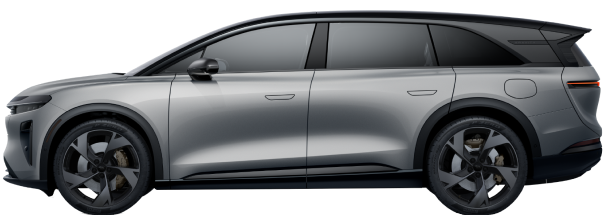

# Lucid Gravity Premium Dashboard

A premium Home Assistant Lovelace card that displays an interactive 3D model of
your Lucid Gravity and animates dynamically based on vehicle sensor states -
doors, frunk, trunk, charging, climate, ride height - mirroring the design
language of the official Lucid mobile app.



## Requirements

- Home Assistant 2024.4 or newer
- The [Lucid Motors integration](https://github.com/borski/ha-lucidmotors)
  (search "Lucid Motors" in HACS) set up and reporting entities

## Installation

### HACS (recommended)

1. HACS → three-dot menu → **Custom repositories** → add
   `https://github.com/Terablo/lucid-gravity-card` with type **Dashboard**.
2. Search for "Lucid Gravity Premium Dashboard" in HACS and download it.
3. Reload your browser when prompted.

HACS registers the dashboard resource automatically - there is no URL to add
by hand. The download is about 9 MB and includes the 3D model, so the card
renders fully offline.

### Manual

1. Download **all assets** from the
   [latest release](https://github.com/Terablo/lucid-gravity-card/releases/latest)
   into `config/www/lucid-gravity-card/` (flat, no subfolders).
2. Add the resource under Settings → Dashboards → ⋮ → Resources:
   ```yaml
   url: /local/lucid-gravity-card/lucid-gravity-card.js
   type: module
   ```

## Quick start

Add a **Manual** card with just:

```yaml
type: custom:lucid-gravity-card
```

The card auto-discovers every entity the Lucid Motors integration created. For
best results, place it in a **Panel (full screen)** dashboard view.

## Configuration

### Auto-discovery (recommended)

The card can find its own entities. Every entity the Lucid Motors integration
creates is tagged with the same attribution, so on first load the card scans
for them and fills in anything you haven't set yourself - an explicit value in
your YAML always wins, this only fills gaps. A minimal config is enough:

```yaml
type: custom:lucid-gravity-card
```

If you have more than one Lucid on the account, point the card at the right
one with `vehicle_name` (matched against the name from the Lucid app, below):

```yaml
type: custom:lucid-gravity-card
vehicle_name: Lucid GRAVITY
```

Open the browser console (F12) after loading the dashboard to see what it
found - the card logs every key it auto-filled and which entity it picked.

### Manual configuration

Any key can still be set explicitly, either to override a wrong auto-discovery
pick or because you'd rather not rely on it. The integration names every
entity after **your car's nickname**, set in the official Lucid app under
**Vehicle Info → Edit → Vehicle Name** - it is not fixed text you can copy from
here. To build an entity ID by hand: lowercase that name, replace spaces (and
any other punctuation) with underscores, then append the entity's own name the
same way - e.g. a car named "Lucid GRAVITY" gives `sensor.lucid_gravity_gear_position`
for its "Gear position" sensor. Fastest way to get the exact spelling: Settings
→ Devices & Services → Entities, filter to the Lucid Motors integration, and
copy the entity ID shown there directly.

```yaml
type: custom:lucid-gravity-card
# Only needed to override auto-discovery, or entity-by-entity if you'd
# rather not rely on it at all:
battery_entity: sensor.lucid_gravity_remaining_battery_percent
range_entity: sensor.lucid_gravity_remaining_range
climate_entity: climate.lucid_gravity_climate_control
driving_entity: sensor.lucid_gravity_gear_position
charging_entity: switch.lucid_gravity_charging
trunk_entity: cover.lucid_gravity_trunk
frunk_entity: cover.lucid_gravity_frunk
lock_entity: lock.lucid_gravity_door_locks
door_fl_entity: binary_sensor.lucid_gravity_front_left_door
door_fr_entity: binary_sensor.lucid_gravity_front_right_door
door_rl_entity: binary_sensor.lucid_gravity_rear_left_door
door_rr_entity: binary_sensor.lucid_gravity_rear_right_door
```

## Features
- **Premium Design**: Dark mode, glassmorphic UI elements matching the Lucid App.
- **Real-time 3D**: Rendering using Google's `model-viewer`.
- **Interactive Controls**: Click the Frunk, Trunk, Lock, Charge, or Climate buttons to toggle them directly from the card.
- **Dynamic Animations**: Doors open, trunk lifts, and camera zooms in when charging.
- **Speed Lines overlay**: Activates when the `driving_entity` is in Drive.
